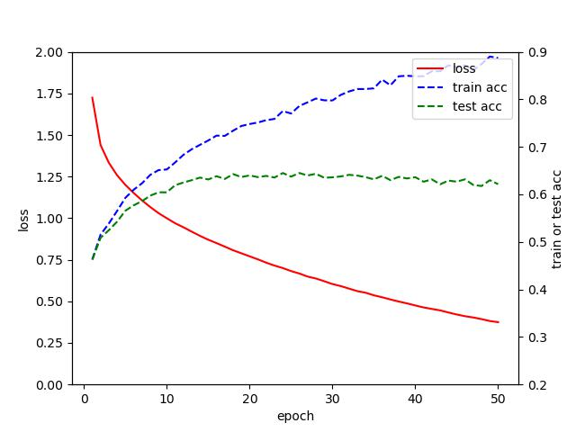
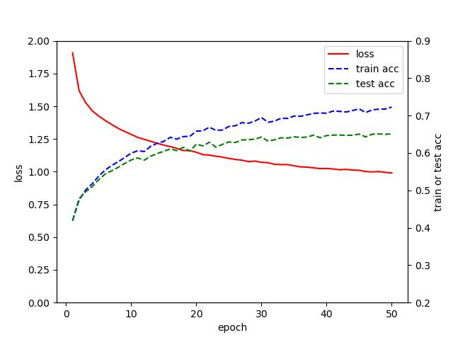

# AISecurity-Course Assignment

## Table of contents

## Introduction

## Installation

## Tuning a hyper-parameter

  

As you can see, this picture shows my initial training results.It is not difficult to find that as the number of training epochs increases, the loss value is decreasing and the accuracy on the training set is increasing. However, there is a huge accuracy gap between the test set and the training set, and the accuracy on the test set shows a decreasing trend in the later stages.I analyzed that the model was overfitting on the training data, so I added some regularization means. Specifically, I used the dropout on the first two linear layers of LeNet.The result is as follows:

  

The results show that the model has better generalizability after using the dropout.

